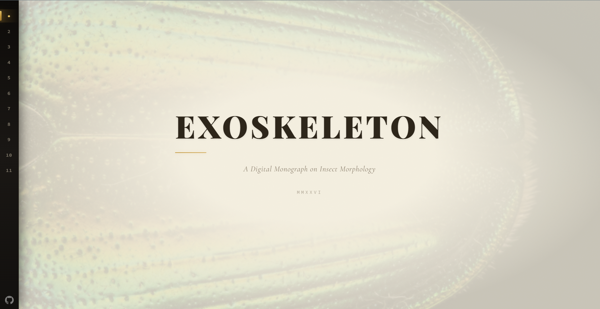
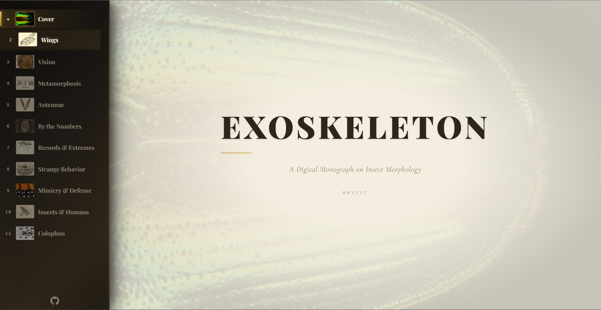
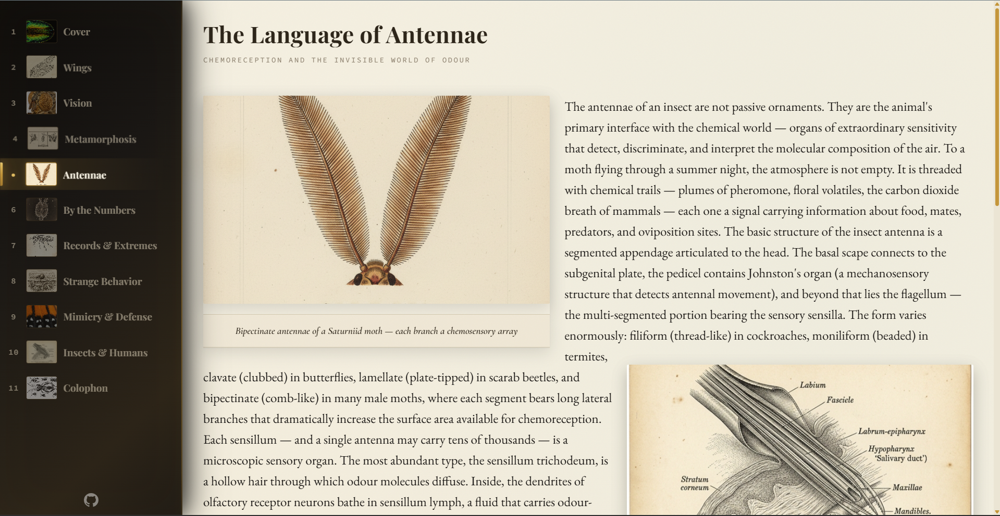
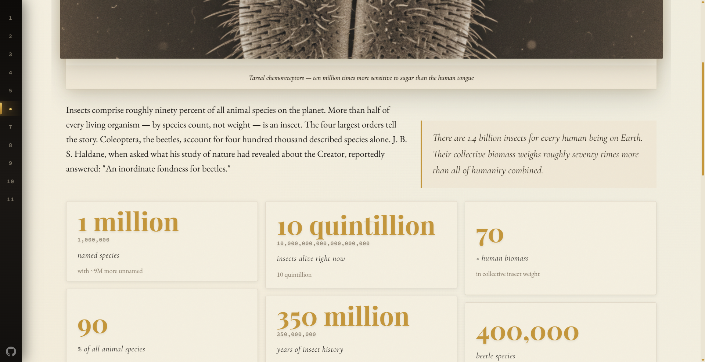

# Exoskeleton

> A Digital Monograph on Insect Morphology

[](./LICENSE)
[](https://nodejs.org)
[](https://react.dev)
[](https://www.typescriptlang.org)
[](https://vite.dev)
[](https://github.com/Poojan38380/EXOSKELETON-A-Digital-Monograph/actions/workflows/test.yml)

An interactive, beautifully typeset book about entomology — built with React, TypeScript, and a **custom text layout engine** that wraps text around images, handles bidirectional text, and corrects emoji. Features a compound-eye cursor that magnifies text with chromatic aberration, a pheromone-and-moth simulation, an animated SVG butterfly that displaces layout, and scroll-driven reveal animations.

**[→ View Live Demo](https://exoskeleton-tau.vercel.app)**

---

## Screenshots

**Home Page**



**Expanded Sidebar Navigation**



**Page with Sidebar Extended**



**Masonry Grid Layout**



## Interactive Features

**Compound Eye Cursor**

https://github.com/user-attachments/assets/exoskeleton-compund-vision-cursor.mp4

**Butterfly Interaction — Text Re-flows Around Animated Obstacle**

https://github.com/user-attachments/assets/exoskeleton-butterfly-interaction.mp4

**Antennae Page — Pheromone Drop Effect**

https://github.com/user-attachments/assets/exoskeleton-antannae-pheromon-effext.mp4

**Full Demo Walkthrough**

https://github.com/user-attachments/assets/exoskeleton-full-demo.mp4

---

## Features

- **Custom Text Layout Engine** — Canvas-based measurement, CSS-accurate line wrapping, obstacle avoidance for inline images, bidi/RTL support, CJK handling
- **Compound Eye Cursor** — Hexagonal facet grid magnifies text under your mouse with chromatic aberration and barrel distortion
- **Pheromone & Moth Simulation** — Click anywhere to drop pheromone trails; watch moths navigate toward them
- **Animated SVG Butterfly** — Flies between text anchors and acts as a live layout obstacle
- **Per-Page Theming** — Each chapter has its own accent color, glow pattern, and texture overlay
- **Collapsible Navigation Rail** — Sidebar with page thumbnails, expands on hover
- **Responsive Design** — Bottom navigation bar on mobile, full sidebar on desktop
- **Image Lightbox** — Fullscreen viewer for insect photographs
- **Zero External UI Libraries** — Only React, React DOM, and test dependencies

## Quick Start

```bash
git clone https://github.com/Poojan38380/EXOSKELETON-A-Digital-Monograph.git
cd EXOSKELETON-A-Digital-Monograph
npm install
npm run dev
```

Open `http://localhost:5173` in your browser.

## Available Scripts

| Command | Description |
|---------|-------------|
| `npm run dev` | Start development server |
| `npm run build` | Type-check and produce a production build |
| `npm run preview` | Preview the production build |
| `npm test` | Run all tests |
| `npm run test:watch` | Run tests in watch mode |
| `npm run test:coverage` | Run tests with coverage report |

## Architecture

```
src/
├── components/          # React UI components
│   ├── pages/          # Page-specific components (11 chapters)
│   └── __tests__/      # Component tests
├── context/            # React context providers (theme, layout, lightbox)
├── content/            # Book text, image URLs, and data
├── layout-engine/      # Custom text layout system (~3,000+ lines)
│   ├── layout.ts       # Main engine: canvas measurement, prepare/layout
│   ├── line-break.ts   # Segment-based line wrapping matching CSS behavior
│   ├── analysis.ts     # Text segmentation, Intl.Segmenter, URL detection
│   ├── measurement.ts  # Canvas text sizing, emoji correction
│   ├── bidi.ts         # Simplified UBA for mixed LTR/RTL
│   └── wrap-geometry.ts # Polygon hull extraction, obstacle avoidance
├── hooks/              # Custom React hooks
├── utils/              # Utility functions (hex grid math)
├── styles/             # CSS: Obsidian Cabinet theme, animations, page styles
└── test/               # Test setup, utilities, mocks
```

## Tech Stack

| Layer | Technology |
|-------|-----------|
| **UI** | React 19, TypeScript |
| **Build** | Vite 7 |
| **Testing** | Vitest, Testing Library, jsdom |
| **CI/CD** | GitHub Actions |
| **Styling** | Plain CSS (no CSS-in-JS) |
| **Pre-commit** | Husky + lint-staged |

## Testing

All features include tests. The project has a solid test suite with 75+ tests across unit, component, and context suites.

```bash
npm test                 # Run all tests
npm run test:watch       # Watch mode
npm run test:coverage    # Coverage report
```

See [TESTING.md](./TESTING.md) for the full guide, and [CONTRIBUTING.md](./CONTRIBUTING.md) for how to contribute.

## Documentation

| Document | Description |
|----------|-------------|
| [CONTRIBUTING.md](./CONTRIBUTING.md) | How to contribute: setup, workflow, coding standards |
| [CODE_OF_CONDUCT.md](./CODE_OF_CONDUCT.md) | Community guidelines (Contributor Covenant 2.1) |
| [CHANGELOG.md](./CHANGELOG.md) | Version history |
| [TESTING.md](./TESTING.md) | Testing conventions and patterns |
| [Worktree Guide](./.github/docs/GUIDES/worktree-guide.md) | Git worktree setup for parallel development |

## Contributing

Contributions are welcome! Please read [CONTRIBUTING.md](./CONTRIBUTING.md) to get started. Don't forget to review our [Code of Conduct](./CODE_OF_CONDUCT.md).

**TL;DR:**

1. Fork & clone
2. `npm install && npm run dev`
3. Create a branch: `git checkout -b feat/your-feature`
4. Add tests for your changes
5. `npm test` — make sure everything passes
6. Open a Pull Request

## License

This project is licensed under the **MIT License** — see the [LICENSE](./LICENSE) file for details.

## Acknowledgments

- Google Fonts: Playfair Display, EB Garamond, Cormorant Garamond, Source Code Pro
- Insect imagery from public domain sources
- Inspired by the tradition of natural history monographs
